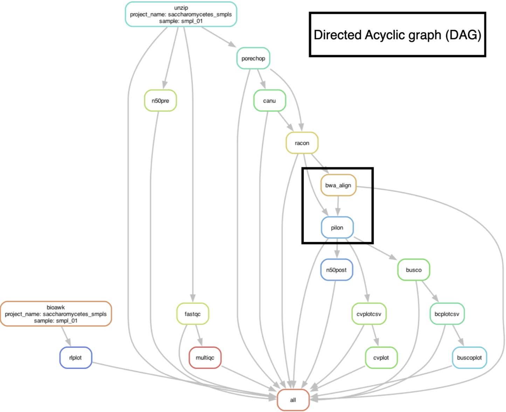
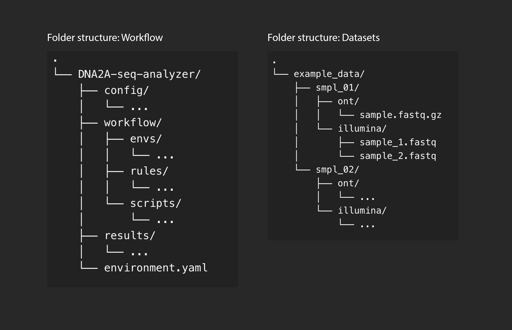

# Snakemake workflow: `DNA2A-seq-analyzer`

DNA2A (DNA (A)ssembly and (A)nalyzer) is a comprehensive toolkit for the automated analysis of eukaryotic long-read sequencing data with [Snakemake](https://snakemake.readthedocs.io/en/stable/). The bioinformatics tool is suitable for raw data from Oxford Nanopore Technologies (ONT) as well as for hybrid sequencing (ONT + Illumina).

## Usage

The usage of this workflow is described in: 
[Install Workflow](documentation/install_workflow.pdf)

[Snakemake Workflow Catalog](https://snakemake.github.io/snakemake-workflow-catalog/?usage=<owner>%2F<repo>)

If you use this workflow in a paper, don't forget to give credits to the authors by citing the URL of this (original) <repo>sitory and its DOI (see above).

## Contents
[Dependencies](#dependencies)
[DAG-Plot](#example-dag-plot)
[Install Miniconda and Mamba](#install-miniconda-and-mamba)
[Create environment and install workflow](#create-environment-and-install-workflow)
[Folder and data structure](#folder-and-data-structure)
[Load samples and start the workflow](#load-samples-and-start-the-workflow)
[Illumina Data](#illumina-data)
[Load Samples with Python](#load-samples-with-python)
[Optional Commands](#optional-commands)
[References](#references)


## Dependencies
[Snakemake](https://snakemake.readthedocs.io/en/stable/), [Conda](https://conda.io/en/latest/index.html), [Python](https://www.python.org/), [R](https://www.r-project.org/)

**The workflow should be started with [Linux](https://ubuntu.com/). How exactly the workflow should be installed is described in the instructions.**

---
## Example; DAG-Plot
*Black rectangle indicates the rules used when Illumina data is included.*



---
## Install Miniconda and Mamba
*Workflow was tested on a Linux [Ubuntu] environment!*

**First you have to install Miniconda3!**
*Tested with: Conda 23.11.0*

```shell
wget https://repo.anaconda.com/miniconda/Miniconda3-latest-Linux-x86_64.sh
chmod +x Miniconda3-latest-Linux-x86_64.sh
./Miniconda3-latest-Linux-x86_64.sh
```

If you do not have Mamba installed in your conda environment!
Tested with: Mamba 1.5.6

```shell
conda install -c conda-forge mamba
```
---

## Create environment and install workflow
**Create a folder for your workflow.**

```shell
mkdir -p path/to/project-workdir
cd path/to/project-workdir
```

**Download the Snakemake workflow from GitHub.**
If you don’t have the workflow yet, you can download it from GitHub. Otherwise, if you already have the data, you can skip the following step.

Download and unzip the workflow from GitHub. You can also download the workflow as a ZIP file and then unpack it in your project folder.

Clone repo from GitHub
```shell
git clone https://github.com/dusti1n/DNA2A-seq-analyzer.git
```

To install the environment with all packages, navigate to the project folder. It is important that you are in the parent folder. This folder contains, for example, the folder: config and workflow. The file (environment.yaml) is also located in the folder.

**Create an env and install all required packages.**
```shell
conda env create -n snakenv -f environment.yaml
conda activate snakenv
```

If you have Mamba you can also use the following command.
```shell
mamba env create -n snakenv -f environment.yaml
mamba activate snakenv
```
---
## Folder and data structure

</p>

---

## Load samples and start the workflow

**Open and set configfile (config.yaml) parameters. Set the path to the folder where your sample folders are located! The sample folders must have the following structure!**

Example:
+ smpl_01/ont/ontfile.fastq.gz; smpl_01/illumina/illuminafile_1.fastq
+ smpl_01/illumina/illuminafile_2.fastq

**The exact folder structure is shown in the image (folder_structure.jpg). It is important that the path to the folder (example_data) is set.**

<space></space>
*File: config.yaml*
**All sample folders are then located in this folder**
```
CONFIG; set sample_path: /path/to/example_data/
```

**Set the project name for your samples; Example: drosophila_samples; This will create a subfolder in ’results’ with the project name you entered.**
```
CONFIG; set project_name: saccharomycetes_smpls
```

**Set save_dict: true to save a JSON file (Dictonary) with your samples!**
```
CONFIG; set save_dict: true
```

**Determine the size of your genome! Example "12m" for Saccharomyces cerevisiae**
```
CONFIG; set canu_genome_size: "12m"
```

**For a specific eukaryotic organism: [List of lineages](https://busco.ezlab.org/list_of_lineages.html)**
```
CONFIG; set busco_lineage: "saccharomycetes_odb10"
```

**FASTQC; Set memory; 8GB should be used as a minimum! Example(use of 8GB): fastqc_memory: "8192";**
```
CONFIG; set fastqc_memory: "8192"
```
---

## Illumina Data
#### This part is important if you also want to use illumina data!
+ Set illumina_data: true; If you want to use Illumina data!
+ Set illumina_data: false; If you don’t want to use Illumina data!
```
CONFIG; set illumina_data: true
```

**Pilon; Set Memory for JAVA heap Space; 32G = 32 Gigabyte;** 
*8GB should be used as a minimum!*
```
CONFIG; set pilon_memory: "32G"
```
---

## Load Samples with Python
#### First load all your samples with the Python script, then you can start the workflow! The Python script creates an automatic database for all your samples.

```shell
python workflow/scripts/import_samples.py
```

**Start the workflow with all available cores and install all packages.**
Workflow creates a results folder with all analyzed samples.

```shell
snakemake --cores all --use-conda
```
---

## Optional Commands

**Create a flowchart (DAG-Plot)**
```shell
snakemake --dag | dot -Tpng > dag.png
```
---

## References

**STAR Protocols**
- [Jun Kim and Chuna Kim - A beginner’s guide to assembling a draft genome and analyzing structural variants with long-read sequencing technologies](https://www.ncbi.nlm.nih.gov/pmc/articles/PMC9254108/)

**Snakemake**
- [Felix Mölder, Kim Philipp Jablonski, Brice Letcher, Michael B. Hall, Christopher H. Tomkins-Tinch, Vanessa Sochat, Jan Forster, Soohyun Lee, Sven O. Twardziok, Alexander Kanitz, Andreas Wilm, Manuel Holtgrewe, Sven Rahmann, Sven Nahnsen, Johannes Köster - Sustainable data analysis with Snakemake](https://doi.org/10.12688/f1000research.29032.1)
- [Snakemake.github.io](https://snakemake.github.io/)